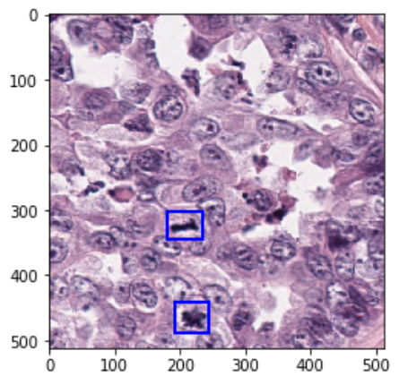

# Detecting mitotic figures with Amazon Rekognition Custom Labels

  

Amazon Rekognition is a machine learning based image and video analysis service that enables developers to build smart applications using computer vision. Developers can quickly take advantage of different APIs to identify objects, people, text, scene and activities in images and videos, as well as inappropriate content.

In this workshop, you are going to train a computer vision (CV) model using Amazon Rekognition Custom Labels that is able to identify mitotic figures in a whole-slide imaging (WSI) data set. Once trained and tested, we are going to deploy a simple application to AWS Fargate to demonstrate how you can integrate your Custom Labels models to your applications.

By the time you complete the workshop, you will have learned how to train an Amazon Rekognition Custom Labels model using a WSI dataset, and how to use that model from a simple containerized application running on ECS/Fargate.

## Get started

To run this as a self-paced lab, we recommend you start with [Amazon SageMaker Studio](https://aws.amazon.com/sagemaker/studio/). If you have not used it before, be sure to check the [Quick Start instructions](https://docs.aws.amazon.com/sagemaker/latest/dg/onboard-quick-start.html) or check [this video](https://www.youtube.com/watch?v=wiDHCWVrjCU) that walks you through the process of onboarding SageMaker Studio.

Your SageMaker Studio role will need to have additional permissions to enable you to call Amazon Rekognition from within Studio. Follow [these instructions](docs/add_role.md) to add the required permissions to the role.

Once you are ready to go, open the [detecting_mitotic_figures.ipynb](detecting_mitotic_figures.ipynb) notebook in SageMaker Studio. Be sure to use an `ml.m5.large` instance to run the kernel. This prevents certain operations from running out of memory.

> **Note**  
> You are responsible for the cost of the AWS services used while running this workshop. There is no additional cost for using this sample. For full details, see the following pricing pages for each AWS service you will be using in this sample. Prices are subject to change.
>
> - [Amazon SageMaker Pricing](https://aws.amazon.com/sagemaker/pricing/)
> - [Amazon Rekognition Pricing](https://aws.amazon.com/rekognition/pricing/)
> - [Amazon S3 Pricing](https://aws.amazon.com/s3/pricing/)

## Dataset

This workshop uses the MITOS_WSI_CMC dataset, which is available on GitHub in the following [repository](https://github.com/DeepPathology/MITOS_WSI_CMC).

We would like to thank Dr. Marc Aubreville for kindly giving us permission to use the MITOS_WSI_CMC dataset for this workshop.

> Aubreville, M., Bertram, C.A., Donovan, T.A. et al. A completely annotated whole slide image dataset of canine breast cancer to aid human breast cancer research. Sci Data 7, 417 (2020). https://doi.org/10.1038/s41597-020-00756-z

## Security

See [CONTRIBUTING](CONTRIBUTING.md#security-issue-notifications) for more information.

## License

This library is licensed under the MIT-0 License. See the LICENSE file.
